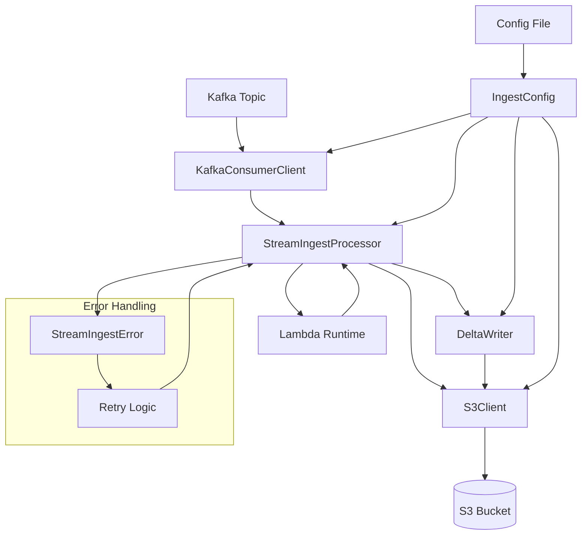
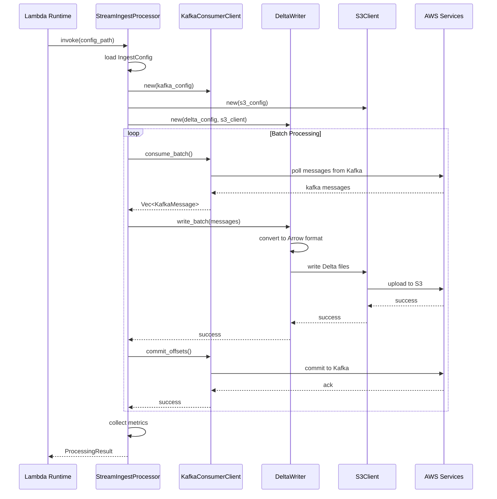
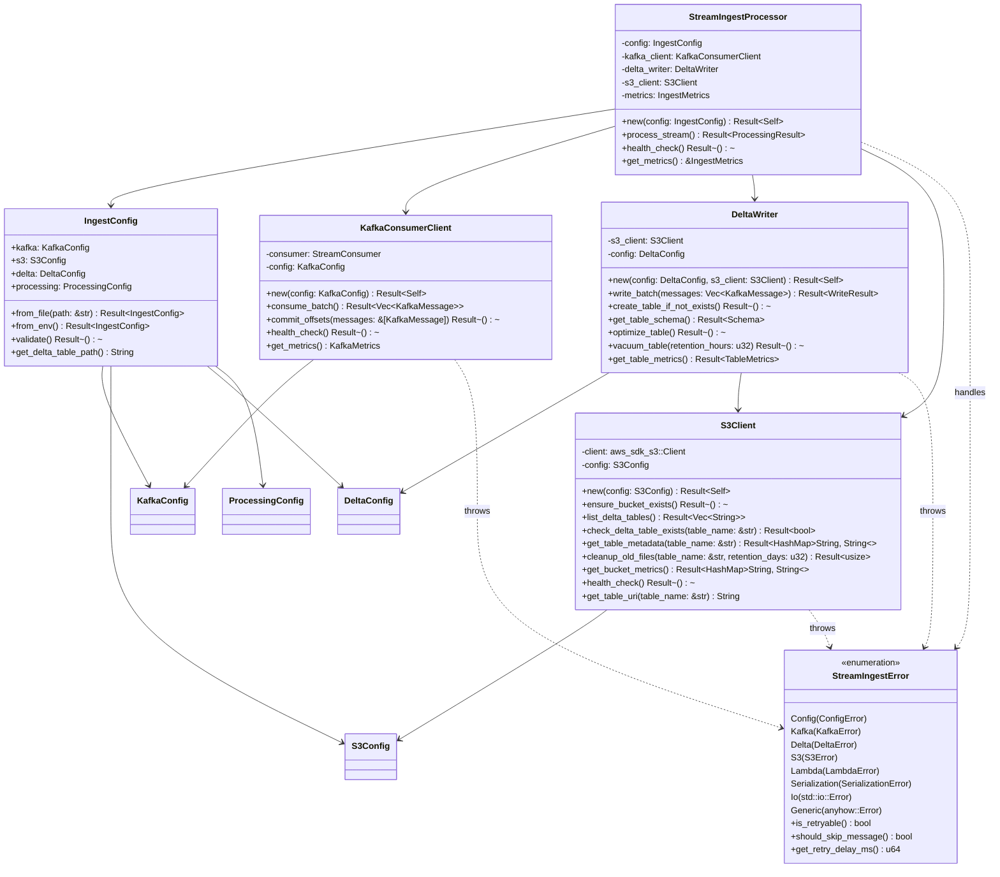
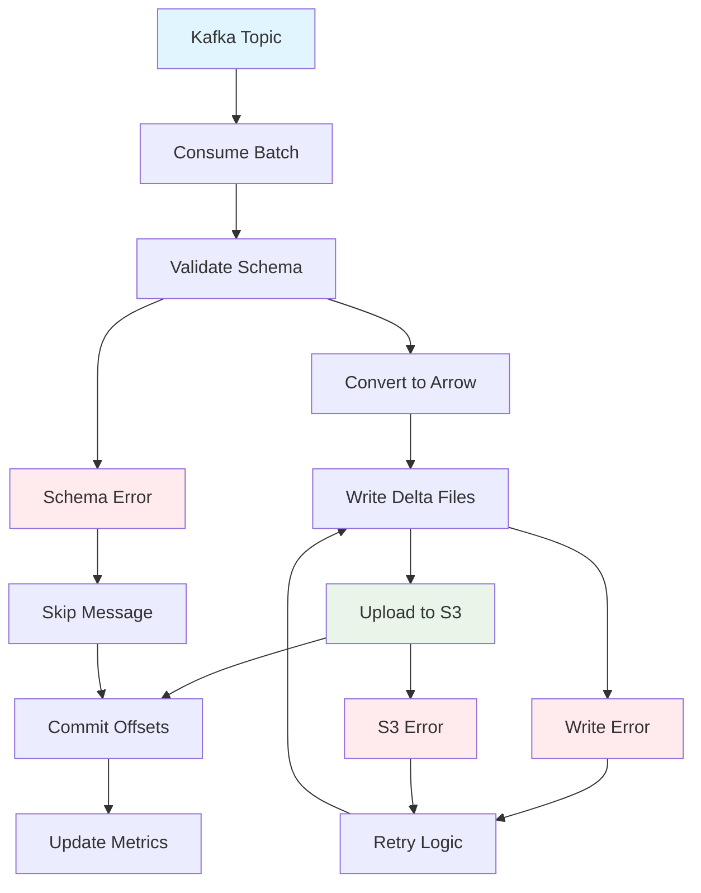

# Stream Ingest Framework

A Rust framework for ingesting Kafka topics into AWS S3 as Delta Lake tables, designed to run on AWS Lambda.

## Getting Started

```shell
brew install librdkafka
```

## Overview

This framework provides a configuration-driven approach to streaming data ingestion, converting Kafka messages into queryable Delta Lake format stored in S3. It's optimized for AWS Lambda deployment with comprehensive error handling and retry logic.

## Architecture

### System Components



### Sequence Diagram



### Class Diagram



## Module APIs

### 1. Config Module (`src/config.rs`)

**Purpose**: Configuration management with YAML support

**Main Types**:
```rust
// Core configuration structure
pub struct IngestConfig {
    pub kafka: KafkaConfig,
    pub s3: S3Config, 
    pub delta: DeltaConfig,
    pub processing: ProcessingConfig,
}

// Schema definition
pub struct SchemaField {
    pub name: String,
    pub data_type: DataType,
    pub nullable: bool,
    pub metadata: Option<HashMap<String, String>>,
}
```

**Key APIs**:
- `IngestConfig::from_file(path: &str) -> Result<IngestConfig>` - Load from YAML file
- `IngestConfig::from_env() -> Result<IngestConfig>` - Load from environment variable
- `IngestConfig::validate() -> Result<()>` - Validate configuration
- `IngestConfig::get_delta_table_path() -> String` - Generate S3 table path

### 2. Kafka Module (`src/kafka.rs`)

**Purpose**: Kafka consumer with batch processing capabilities

**Main Types**:
```rust
pub struct KafkaConsumerClient {
    consumer: StreamConsumer,
    config: KafkaConfig,
}

pub struct KafkaMessage {
    pub key: Option<String>,
    pub payload: Option<String>, 
    pub topic: String,
    pub partition: i32,
    pub offset: i64,
    pub timestamp: Option<i64>,
    pub headers: HashMap<String, String>,
}
```

**Key APIs**:
- `KafkaConsumerClient::new(config: KafkaConfig) -> Result<Self>` - Create consumer
- `consume_batch() -> Result<Vec<KafkaMessage>>` - Consume message batch
- `commit_offsets(messages: &[KafkaMessage]) -> Result<()>` - Commit processed offsets
- `health_check() -> Result<()>` - Verify Kafka connectivity

**Utility Functions**:
- `parse_json_message(payload: &str) -> Result<Value>` - Parse JSON payload
- `extract_partition_values(message: &KafkaMessage, columns: &[String]) -> HashMap<String, String>` - Extract partition values

### 3. S3 Module (`src/s3.rs`)

**Purpose**: AWS S3 integration with Delta Lake support

**Main Types**:
```rust
pub struct S3Client {
    client: aws_sdk_s3::Client,
    config: S3Config,
}
```

**Key APIs**:
- `S3Client::new(config: S3Config) -> Result<Self>` - Create S3 client
- `ensure_bucket_exists() -> Result<()>` - Verify bucket access
- `list_delta_tables() -> Result<Vec<String>>` - List existing Delta tables
- `check_delta_table_exists(table_name: &str) -> Result<bool>` - Check table existence
- `get_table_metadata(table_name: &str) -> Result<HashMap<String, String>>` - Get table info
- `cleanup_old_files(table_name: &str, retention_days: u32) -> Result<usize>` - Clean old files
- `get_bucket_metrics() -> Result<HashMap<String, String>>` - Get bucket statistics
- `health_check() -> Result<()>` - S3 connectivity test
- `get_table_uri(table_name: &str) -> String` - Generate table URI

### 4. Delta Module (`src/delta.rs`)

**Purpose**: Delta Lake operations with Arrow conversion

**Main Types**:
```rust
pub struct DeltaWriter {
    s3_client: S3Client,
    config: DeltaConfig,
}

pub struct WriteResult {
    pub files_written: usize,
    pub rows_written: usize,
    pub bytes_written: usize,
}
```

**Key APIs**:
- `DeltaWriter::new(config: DeltaConfig, s3_client: S3Client) -> Result<Self>` - Create writer
- `write_batch(messages: Vec<KafkaMessage>) -> Result<WriteResult>` - Write message batch
- `create_table_if_not_exists() -> Result<()>` - Initialize Delta table
- `get_table_schema() -> Result<Schema>` - Get Arrow schema
- `optimize_table() -> Result<()>` - Compact small files
- `vacuum_table(retention_hours: u32) -> Result<()>` - Remove old versions

**Conversion Functions**:
- `convert_to_arrow_batch(messages: &[KafkaMessage]) -> Result<RecordBatch>` - Convert to Arrow
- `create_arrow_schema(config: &DeltaConfig) -> Result<Schema>` - Create Arrow schema

### 5. Error Module (`src/errors.rs`)

**Purpose**: Comprehensive error handling with retry logic

**Main Types**:
```rust
pub enum StreamIngestError {
    Config(ConfigError),
    Kafka(KafkaError), 
    Delta(DeltaError),
    S3(S3Error),
    Lambda(LambdaError),
    Serialization(SerializationError),
    Io(std::io::Error),
    Generic(anyhow::Error),
}
```

**Key APIs**:
- `StreamIngestError::is_retryable() -> bool` - Check if error is retryable
- `StreamIngestError::should_skip_message() -> bool` - Check if message should be skipped
- `StreamIngestError::get_retry_delay_ms() -> u64` - Get retry delay

**Error Categories**:
- `ConfigError` - Configuration validation errors
- `KafkaError` - Kafka consumer/producer errors
- `DeltaError` - Delta Lake operation errors
- `S3Error` - AWS S3 operation errors
- `LambdaError` - AWS Lambda runtime errors
- `SerializationError` - Data serialization/parsing errors

### 6. Main Module (`src/main.rs`)

**Purpose**: Lambda handler and orchestration

**Main Types**:
```rust
pub struct StreamIngestProcessor {
    config: IngestConfig,
    kafka_client: KafkaConsumerClient,
    delta_writer: DeltaWriter,
    s3_client: S3Client,
    metrics: IngestMetrics,
}

pub struct ProcessingResult {
    pub success: bool,
    pub messages_processed: usize,
    pub batches_processed: usize,
    pub bytes_processed: usize,
    pub processing_time_ms: u64,
    pub errors: Vec<String>,
    pub metrics: IngestMetrics,
}
```

**Key APIs**:
- `StreamIngestProcessor::new(config: IngestConfig) -> Result<Self>` - Create processor
- `process_stream() -> Result<ProcessingResult>` - Main processing loop
- `health_check() -> Result<()>` - Overall system health check
- `get_metrics() -> &IngestMetrics` - Get processing metrics

**Lambda Integration**:
- `lambda_handler(event: Value, _context: Context) -> Result<Value>` - Lambda entry point
- `local_main() -> Result<()>` - Local development entry point

## Data Flow



## Configuration Example

```yaml
kafka:
  bootstrap_servers: "localhost:9092"
  topic: "user-events"
  consumer_group: "delta-ingest"
  auto_offset_reset: "earliest"

s3:
  bucket: "my-data-lake"
  region: "us-east-1"
  prefix: "delta-tables"

delta:
  table_name: "user_events"
  write_mode: "append"
  partition_columns: ["date"]
  schema:
    - name: "user_id"
      data_type: "int64"
      nullable: false
    - name: "event_type"
      data_type: "utf8"
      nullable: false
    - name: "timestamp"
      data_type: "timestamp_millisecond"
      nullable: false

processing:
  batch_size: 1000
  batch_timeout_ms: 30000
  max_retries: 3
  enable_compression: true
  compression_type: "snappy"
```

## Development Commands

- **Build**: `cargo build --release`
- **Test**: `cargo test --lib` (unit tests)
- **Check**: `cargo check`
- **Format**: `cargo fmt`
- **Lint**: `cargo clippy`

## Testing

The framework includes comprehensive unit tests:

- **Config Tests**: 16 tests covering YAML parsing, validation, and environment loading
- **Error Tests**: 15 tests covering error handling, retry logic, and conversions
- **S3 Tests**: 18 tests covering S3 operations, URI generation, and utilities

Run tests: `cargo test --lib`

## Deployment

Designed for AWS Lambda deployment with configurable timeout and memory limits. Supports both Lambda runtime and local development modes.

## Key Features

- **Configuration-driven**: YAML-based configuration with validation
- **Batch processing**: Configurable batch sizes for optimal performance
- **Schema evolution**: Optional schema merging for evolving data
- **Partitioning support**: Configurable partition columns
- **Retry logic**: Intelligent retry with exponential backoff
- **Health checks**: Built-in connectivity verification
- **Comprehensive metrics**: Processing statistics and monitoring
- **Error handling**: Detailed error categorization and handling