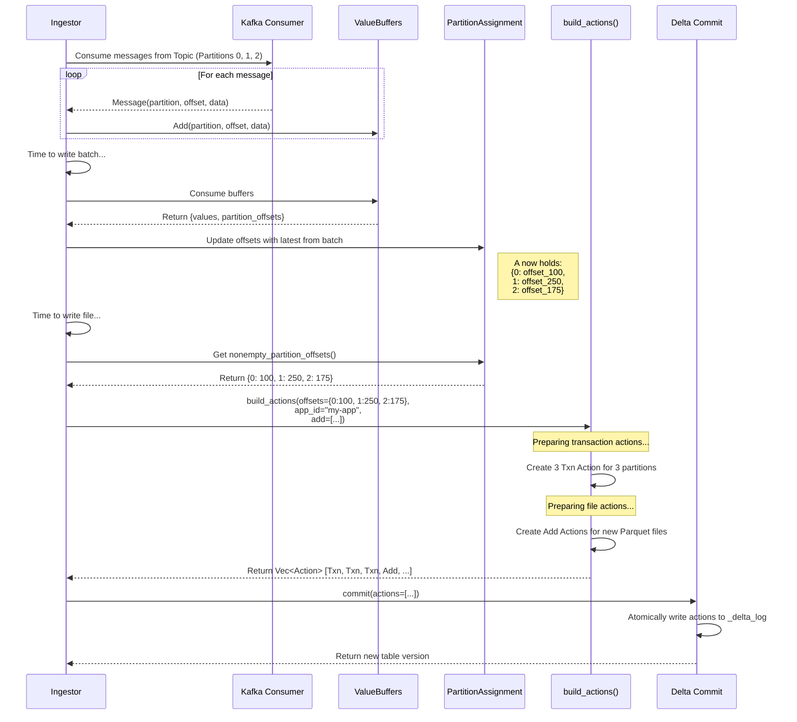

# Fault Tolerance

<!-- TOC -->
* [Fault Tolerance](#fault-tolerance)
  * [Failure modes](#failure-modes)
  * [Consuming Failures](#consuming-failures)
    * [Consumer Rebalance](#consumer-rebalance)
  * [Processing Failures](#processing-failures)
  * [Delta Table Failures](#delta-table-failures)
    * [Schema Changed](#schema-changed)
    * [Handle Concurrent Writes](#handle-concurrent-writes)
<!-- TOC -->

This document talks about fault-tolerance. It is about what the failure modes are and how the application is resilient to the transient ones.

## Failure modes
- compute backend failed
    - while consuming Kafka
    - while writing S3
- consuming failures
  - message payload is not valid JSON/ Avro.
- processing failures
    - deserialization failures
    - transform failures
- delta table failures
  - schema changed, schema drift (non null now null), schema incompatible at write time.
  - concurrency: race conditions with multiple writers
  - delta locking error?
- integration failures
  - error talking to Kafka, other message queue
  - error talking to storage system like disk, S3
  - high latency, slow response in general -> timeout and retry?
  - schema registry -> we don't decode Avro and alike to maybe not handle these
  - throttling
- operational
  - wrong app_id causing app to not use committed offset and starts afresh
  - missing kafka heartbeat, removed from consumer group?

## Consuming Failures

### Consumer Rebalance
Failure: A Kafka consumer group rebalance occurs, which is a normal, transient event where Kafka reassigns topic partitions among active consumers. This requires the application to adjust its state to avoid processing duplicate data or missing data on its newly assigned partitions.

Solution:
- loop checking Kafka's ConsumerContext for the signal when a rebalance is happening
- if yes, it triggers a state reset
  - clear all memory buffers and writers
  - re-read last committed offsets from Delta log for new partition assignment
  - `seek` on Kafka consume to reposition to correct offset

## Processing Failures

We probably don't care about deserialization and transformation failures as we dump payload as is to the sink.
This should be given more thoughts later in case we do light transformation, parsing.

## Delta Table Failures

### Schema Changed
We avoid this failure mode by enforcing all the messages from streaming to 
conform to a fixed schema on storage regardless of whether
their body is valid (invalid JSON, Avro, etc.).

For example with the following schema, the message body is stored in message_payload
regardless of whether it's valid in the parsing process later.
``` 
stream_topic: string
stream_partition: string
stream_offset: string
message_timestamp: timestamp
message_payload: bytes/ string
```

### Handle Concurrent Writes

In case there are conflicts between multiple writers, we use Delta Lake `optimistic concurrency control` with retry and exponential backoff.
- try to commit
- if failed, backoff and retry until succeeded with configurable max retries



Example
```rust 
const MAX_RETRIES: u32 = 1000;
const INITIAL_BACKOFF_MS: u64 = 100;

// return delta table version after writing
fn write(table: &mut DeltaTable) -> Result<i64>{
    // one add action for all files of this batch.
    // three transaction actions for 3 topic partitions (assuming here we have a topic with 3 partitions)
    let actions = vec![/* Txn, Txn, Txn, Add */];
    let mut attempt_number: u32 = 0;
    loop {
        // commit a txn, up to 15 retries. error early if a concurrent txn
        // already committed and conflicts with this txn.
        match deltalake_core::operations::transaction::commit(
            table.log_store().clone().as_ref(): &dyn LogStore,
            actions: Vec<Action>,
            delta_operation: DeltaOperation,
            read_snapshot: &DeltaStableState,
            None: Option<HashMap<String, Value>>,
        ).await {
            Ok(v) => {
                // ... success logic ...
                return Ok(v)
            },
            Err(e) => match e {
                DeltaTableError::VersionAlreadyExists(_) => {
                    if attempt_number >= MAX_RETRIES {
                        log::error!("Transaction attempt failed after {} retries.", MAX_RETRIES);
                        return Err(e); // Return the last VersionAlreadyExists error
                    }
                    let backoff_ms = INITIAL_BACKOFF_MS * 2_u64.pow(attempt_number);
                    sleep(Duration::from_millis(backoff_ms)).await;
                    table.update().await?; // refresh table state before next attempt
                    attempt_number += 1;
                }
                _ => {
                    // For other errors, fail immediately
                    log::error!("An unrecoverable error occurred during commit: {:?}", e);
                    return Err(e);
                }
            }
        }
    }
}
```